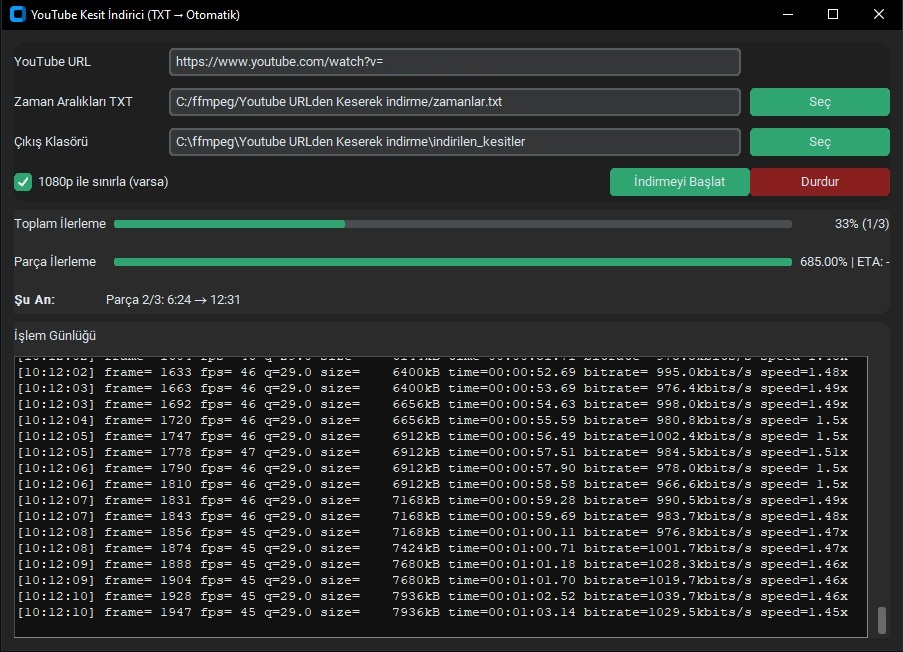

# 🎬 YouTube TXT Kesit İndirici (CustomTkinter GUI)

🧠 **Amaç:**  
YouTube videolarından `.txt` dosyasında belirtilen zaman aralıklarını **otomatik olarak kesip indiren** bir masaüstü uygulamasıdır.  
Python ile geliştirilmiş olup, arayüzü **CustomTkinter** kütüphanesiyle hazırlanmıştır.  
Her kesit `yt-dlp` ve `FFmpeg` kullanılarak **1080p (varsa)** kalitede indirilir.

---

## 🚀 Özellikler
- 📂 TXT dosyasından zaman aralıklarını otomatik okur.  
- 🎥 Her aralık için ayrı MP4 dosyası oluşturur.  
- 🪶 GUI (grafik arayüz) ile kolay kullanım.  
- 🧾 İlerleme çubukları (Toplam ve Parça).  
- 🪵 Gerçek zamanlı log ekranı (scrollbar’lı).  
- ⏹️ Durdur butonu ile güvenli iptal.  
- ⚡ Thread’li yapı sayesinde arayüz donmaz.

---

## 🛠️ Gerekli Kurulumlar

### 1️⃣ Gereken Kütüphaneler
```bash
pip install yt-dlp customtkinter
```

### 2️⃣ FFmpeg kurulumu
- [https://ffmpeg.org/download.html](https://ffmpeg.org/download.html) adresinden indir.
- Kurulum sonrası `ffmpeg` dizinini sistem **PATH**’ine ekle.

---

## 🧩 Kullanım

### 1️⃣ TXT Dosyası Oluştur
Örnek `araliklar.txt` içeriği:
```
0:58 05:55
6:24 12:31
12:59 19:00
```

### 2️⃣ Programı Çalıştır
```bash
python yt_txt_kesit_indirici.py
```

### 3️⃣ Arayüzde:
- 🎯 YouTube URL’sini gir.
- 📄 TXT dosyasını seç.
- 📁 Çıkış klasörünü belirle.
- ▶️ **“İndirmeyi Başlat”** butonuna tıkla.

İndirme ilerlemesini anlık olarak **progress bar** ve **log penceresinde** görebilirsin.  
Tüm kesitler seçtiğin klasöre `kesit_01.mp4`, `kesit_02.mp4` … şeklinde kaydedilir.

---

## 📷 Arayüz Görünümü


---

## 💡 Teknik Bilgiler
- **Python sürümü:** 3.10 veya üzeri  
- **Kütüphaneler:** `yt-dlp`, `customtkinter`, `tkinter`, `subprocess`, `threading`  
- **Platform:** Windows / macOS / Linux  
- **Çıktı formatı:** `.mp4`

---

## 🧑‍💻 Geliştirici Notları
- 🧩 Arayüz “Metro” tarzı sade ve koyu temada tasarlanmıştır.  
- 🧠 Threading sayesinde indirme işlemi arayüzü dondurmaz.  
- 🪶 Kod yapısı genişletilebilir (örneğin YouTube playlist desteği eklenebilir).

---

## ❤️ Katkıda Bulun
Pull request’ler ve iyileştirme önerileri memnuniyetle karşılanır.  
Sorun bildirimi için `Issues` sekmesini kullanabilirsin.

---

## 📜 Lisans
Bu proje **MIT Lisansı** ile lisanslanmıştır.  

---
